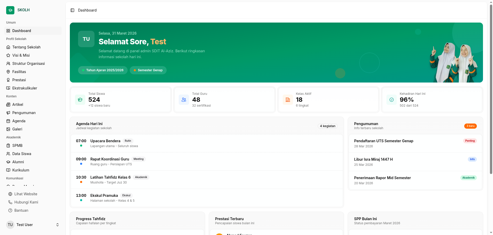
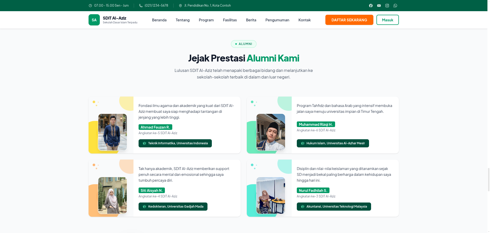
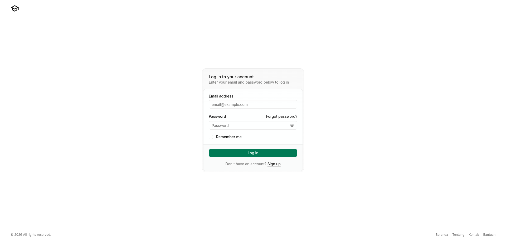

# Skolh

Platform web profil sekolah modern dengan sistem Penerimaan Peserta Didik Baru (PPDB) terintegrasi. Dibangun di atas Laravel 13 dan React 19.



## Screenshots





## Fitur

**Profil Sekolah**
- Tentang Sekolah
- Visi & Misi
- Struktur Organisasi
- Fasilitas
- Prestasi
- Ekstrakulikuler

**Konten**
- Artikel
- Pengumuman
- Agenda
- Galeri

**Akademik**
- SPMB (Sistem Penerimaan Murid Baru)
- Data Siswa
- Alumni
- Kurikulum

**Komunikasi**
- Pesan Masuk
- Testimoni
- Laporan

**Pengaturan**
- Preferensi Situs
- Manajemen User
- Pengaturan Akun

**Autentikasi**
- Login & registrasi dengan verifikasi email dan two-factor authentication

## Tech Stack

**Backend**
- PHP 8.3+
- Laravel 13
- Laravel Fortify (autentikasi)
- Laravel Wayfinder (typed routes)
- Pest (testing)

**Frontend**
- React 19
- Inertia.js v3
- Tailwind CSS v4
- Radix UI + shadcn/ui
- TypeScript

## Requirements

- PHP >= 8.3
- Composer
- Node.js >= 20
- Database (MySQL / PostgreSQL / SQLite)

## Instalasi

```bash
git clone https://github.com/abdasis/skolh.git
cd skolh

composer install
npm install

cp .env.example .env
php artisan key:generate
```

Sesuaikan konfigurasi database di `.env`, lalu:

```bash
php artisan migrate
php artisan db:seed
```

Jalankan development server:

```bash
composer run dev
```

## Testing

```bash
php artisan test
```

## Kontribusi

Kontribusi sangat disambut. Silakan buka issue terlebih dahulu untuk mendiskusikan perubahan yang ingin dilakukan.

1. Fork repo ini
2. Buat branch fitur: `git checkout -b feat/nama-fitur`
3. Commit perubahan: `git commit -m 'feat: tambah nama-fitur'`
4. Push ke branch: `git push origin feat/nama-fitur`
5. Buka Pull Request

## Lisensi

[MIT + Commons Clause](LICENSE)

Bebas digunakan dan dimodifikasi, namun **tidak boleh dijual atau dikomersialisasi** oleh pihak lain selain pemilik asli.
